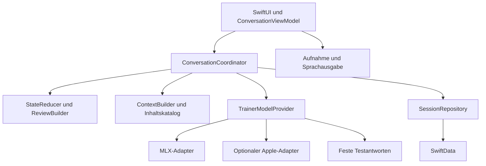

# Architektur und Entwicklungsumgebung

## Zielplattform

Arbeitsentscheidung: iOS 27, iPhone 14 und neuer als angestrebter Gerätekreis. iPhone 17 ist das erste reale Testgerät. Betriebssystem-Kompatibilität und ausreichende Modellleistung werden separat nachgewiesen.

Der MLX-Adapter für `LanguageModelSession` benötigt das 27er-SDK [N1]. Die auf diesem Mac ausgewählte Installation ist Xcode 26.6 mit iOS-26.5-SDK. Deshalb gehört das Aktualisieren beziehungsweise Auswählen eines Xcode mit 27er-SDK zum Setup. Die unabhängigen Swift-Verträge lassen sich bereits mit der vorhandenen Toolchain prüfen.

## Projektstruktur

Ein Repository, eine iOS-App, ein lokales Swift-Paket. Die folgende Struktur ist der anzulegende Projektbaum; dieses Dokument selbst erzeugt ihn noch nicht.

```text
Beratungstrainer/
├── Beratungstrainer.xcodeproj
├── Beratungstrainer/
│   ├── App/                       App-Einstieg, Abhängigkeiten, Navigation
│   ├── Features/
│   │   ├── ScenarioSelection/
│   │   ├── Conversation/
│   │   ├── Review/
│   │   └── History/
│   ├── Services/
│   │   ├── Models/                MLX- und optional Apple-Adapter
│   │   ├── Storage/               SwiftData-Repository
│   │   ├── Audio/                 Aufnahme, ASR, TTS
│   │   └── Export/                Markdown und PDF
│   └── Resources/
│       ├── Content/               erzeugte, geprüfte JSON-Inhalte
│       └── Models/                lokal bereitgestellte Modellartefakte
├── Packages/TrainerCore/
│   ├── Package.swift
│   ├── Sources/TrainerCore/
│   │   ├── Contracts/
│   │   ├── ConversationCoordinator.swift
│   │   ├── StateReducer.swift
│   │   ├── ContextBuilder.swift
│   │   ├── TipSelector.swift
│   │   └── ReviewBuilder.swift
│   └── Tests/TrainerCoreTests/
├── ContentSource/                 Markdown/YAML: Figuren, MI, Tipps
├── Tools/                         Inhaltsprüfung und Modelltest
├── Evaluation/                    fachlich geprüfte Fälle, Referenzdialoge
├── Documentation/                 dieser Bauplan und Entscheidungsprotokoll
├── AGENTS.md                      kurze Regeln für die Umsetzung
└── .gitignore
```

## Abhängigkeiten und Zuständigkeiten



- `TrainerCore` importiert ausschließlich Swift-Standardbibliothek und Foundation. Kein SwiftUI, SwiftData, FoundationModels, MLX oder Audio-Framework.
- `ConversationViewModel` läuft auf dem Main Actor und stellt einen UI-Zustand bereit. Es kennt keine Prompttexte und berechnet keine Offenheit.
- `ConversationCoordinator` ist ein Actor und besitzt genau eine aktive Sitzung sowie höchstens einen laufenden Turn. Er orchestriert Aufrufe, Validierung und Speicherung.
- `StateReducer`, `TipSelector` und `ReviewBuilder` sind deterministisch: identische Eingaben ergeben identische Ergebnisse.
- `TrainerModelProvider` stellt zwei fachlich getrennte Operationen bereit: Einordnung und Figurenantwort. Beide dürfen dieselben geladenen Gewichte verwenden. Klassifikation und Rollenspiel teilen keinen impliziten Chatverlauf.
- Der Adapter übersetzt eigene Datentypen in das jeweilige Framework. `@Generable`-Typen liegen ausschließlich im Adapter und werden anschließend in Core-Typen umgewandelt.
- Die App erzeugt ihre Abhängigkeiten am Einstieg. Keine globalen Service-Singletons.

## Bibliotheken und Versionierung

V1 benötigt zunächst SwiftUI, Foundation, SwiftData und den MLX-Stack. Audio kommt in einem späteren Paket hinzu. Keine zusätzlichen Architekturframeworks im ersten Aufbau.

Bei der ersten realen Integration werden ein funktionierender MLX-Release oder ein vollständiger Commit sowie alle aufgelösten Abhängigkeiten festgehalten. `Package.resolved` wird eingecheckt. Ungeprüfte `main`-Abhängigkeiten gehören nicht in den reproduzierbaren Bauplan. Der konkrete Pin wird erst nach einem erfolgreichen Build und einem lokalen Ladeversuch eingetragen; eine bloß existierende Versionsnummer reicht nicht.

`Models.lock.json` dokumentiert später pro Modell: Herkunft, genaue Revision, Dateiliste, SHA-256, Quantisierung, Tokenizer, Chatvorlage, Lizenzdatei und benötigte Laufzeit. Die Gewichte selbst werden lokal in das App-Bundle eingebunden. Der Adapter verwendet einen lokalen Loader; Beispielcode, der automatisch von Hugging Face lädt, darf nicht unverändert übernommen werden.

## Persistenz

Für V1 speichert SwiftData pro Sitzung einen versionierten `SessionSnapshot` als codierten Datenwert sowie Indexfelder für ID, Beginn, Figur, Abschluss und Revision. So kann eine vollständige Gesprächsrunde mit einem Save atomar gesichert werden, ohne sofort zahlreiche voneinander abhängige Datenbanktabellen einzuführen.

- `SessionRepository.commit` prüft die erwartete Revision und die eindeutige Turn-ID. Doppelte identische Übernahme ist idempotent; abweichende Wiederverwendung derselben ID ist ein Fehler.
- Pro Sitzung schreibt genau ein Repository-Actor. Kein zweiter UI-Schreibpfad.
- Ein ausstehender Eingabetext wird separat gespeichert. Nach Absturz bleibt er ein Entwurf und zählt nicht als vollständiger Gesprächswechsel.
- Inhalts-, Regel-, Prompt-, Modell- und Snapshot-Version werden mitgeführt. Alte Sitzungen werden mit ihrer damaligen Einordnung angezeigt.
- Figureninhalt, Kodierleitfaden und Tippbestand werden als `SessionContent` eingefroren. Fortsetzen ist nur mit einer unterstützten Regel-/Promptversion und dem ursprünglichen Modellprofil erlaubt. Andernfalls bleibt die Sitzung les- und exportierbar; ein Wechsel beginnt eine neue Sitzung.
- Migrationsfehler dürfen keine Sitzung still löschen. Zunächst Originaldaten bewahren und eine verständliche Fehlermeldung anbieten.
- CloudKit-Synchronisation bleibt deaktiviert. Protokolle werden nur auf ausdrücklichen Export geteilt. Für die geplante ausschließlich lokale Ablage werden Daten von App-gesteuerter Cloud-Synchronisation und System-Backups ausgeschlossen; Dateischutz wird bei der Implementierung eingerichtet und geprüft.
- Rohaufnahmen werden standardmäßig nicht dauerhaft gespeichert. Modellantworten und Protokolle gehören nicht ins allgemeine Debug-Log.

Snapshots verwenden Schema-Version 1 und camelCase-JSON-Schlüssel. Datumswerte werden mit einer zentral konfigurierten ISO-8601-Codierung gespeichert. Alle verfügbaren Fakten-IDs müssen im eingefrorenen Figureninhalt existieren. Der feste Einstieg wird aus diesem Inhalt gelesen und ist kein zusätzlicher `CompletedTurn`. Beim Anlegen gelten Revision 0, keine Turns, `opennessStart`, leere Fragenfolge und leere Gutschrift-/Offenbarungshistorie.

`savePending` erfordert eine aktive Sitzung mit passender Revision. Ein erneuter Aufruf mit derselben ID darf nur denselben Entwurf bestätigen; Bearbeiten nach Abbruch verwirft diesen Entwurf und erzeugt eine neue Turn-ID. `commit` prüft zusätzlich Eingabe, `stateBefore` und unveränderte Sitzungsversionen. `finish` erhält einen expliziten Zeitpunkt, erhöht die Revision genau einmal und ist bei Wiederholung mit demselben Zeitpunkt idempotent. Beenden mit einem offenen Entwurf erfordert dessen ausdrückliches Verwerfen in der Oberfläche. `delete` ist idempotent und löscht auch Pending-Daten; spätere Resultate dürfen eine fehlende Sitzung nicht neu anlegen.

## Speicher und Ausführung

Einordnung und Antwort laufen nacheinander auf derselben Modellinstanz. Es werden niemals zwei LLMs zugleich geladen, nur um beide Teilaufgaben auszuführen. Ein Modellwechsel ist ausschließlich außerhalb einer aktiven Sitzung möglich.

Für ASR und LLM wird später die gemeinsame Speicherspitze gemessen. ASR darf bei Speicherproblemen nach der Transkription entladen werden; das ist gegen zusätzliche Ladezeit abzuwägen. Ein Speicher-Entitlement ersetzt keinen Gerätetest.

Bei App-Hintergrundwechsel werden Aufnahme, Sprachausgabe und laufende Inferenz für V1 beendet. Der letzte vollständige Turn bleibt erhalten, eine offene Eingabe wird als Entwurf angeboten. Später zurückkehrende Ergebnisse des abgebrochenen Tasks werden anhand seiner ID verworfen.

## Erweiterung um weitere Ansätze

Figuren und Tipps sind Inhalte. Die Regeln eines neuen Beratungsansatzes passen nur dann ohne Codeänderung hinein, wenn sie dieselben vorgesehenen Regeloperationen und Auswertungsarten verwenden. Ein neuer Ansatz mit anderer Gesprächslogik benötigt eine neue, getestete Implementierung hinter einer stabilen Schnittstelle. „Nur einen Ordner hinzufügen“ wird deshalb nicht pauschal versprochen.

Quellenkürzel werden in [06-Nachweise.md](06-Nachweise.md) aufgelöst.
